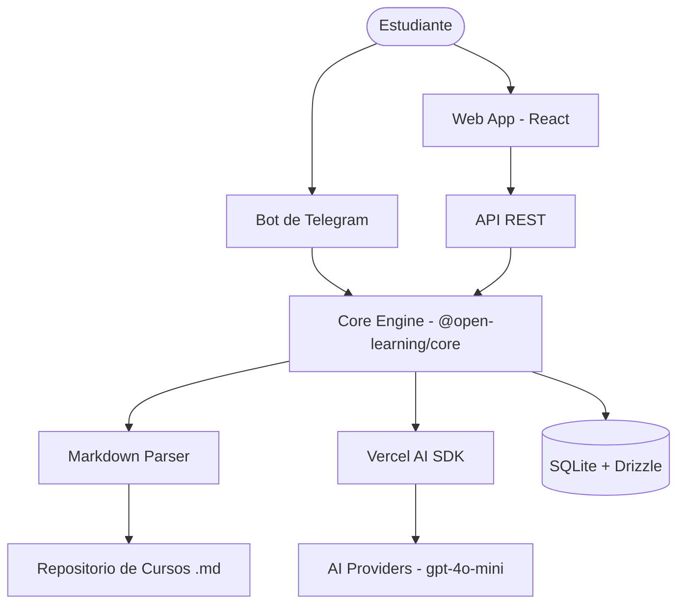
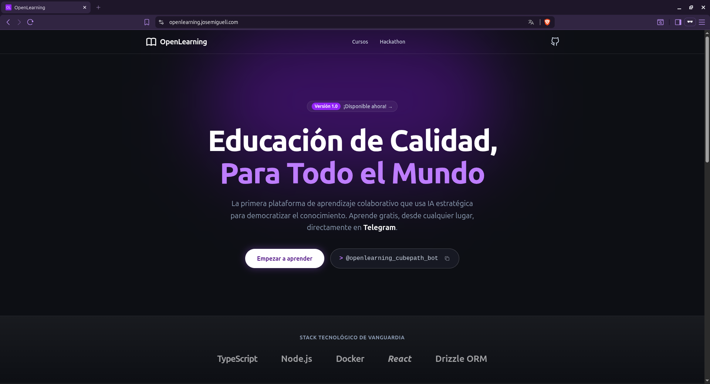
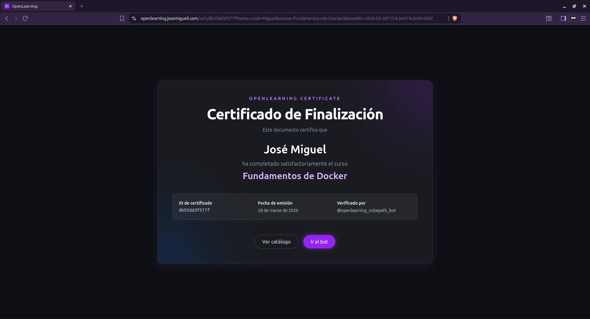
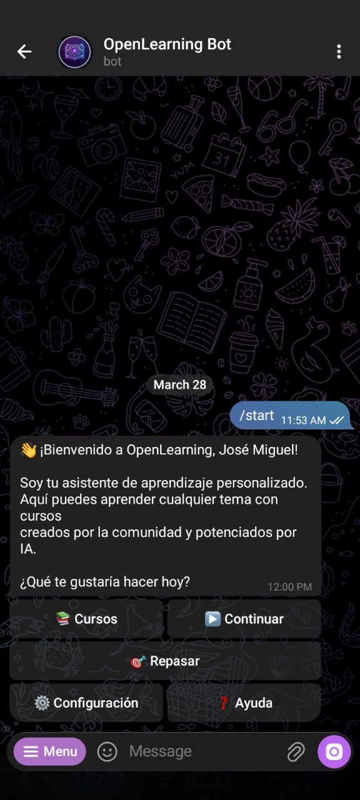
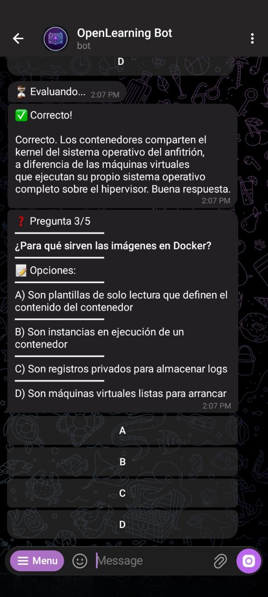
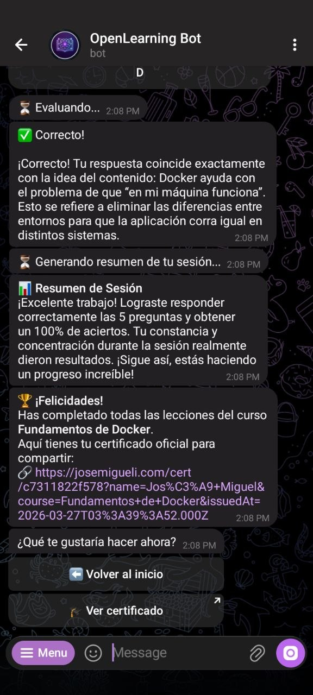

<div align="center">

# 🎓 OpenLearning — Aprendizaje Colaborativo & IA Accesible

### Una plataforma abierta de cursos personalizados, accesible desde cualquier smartphone, potenciada por IA estratégica.

[](https://midu.link/cubepath)
[](#-stack-tecnológico)
[](https://t.me/openlearning_cubepath_bot)

[📘 Ver Idea](#-la-visión) · [🏗️ Arquitectura](#-arquitectura) · [🛠️ Cómo empezar](#-desarrollo) · [🎁 CubePath](#-despliegue-en-cubepath) · [📷 Galería](#-galería)

### 🚀 Probar Ahora

|                          🤖 Bot de Telegram                          |                            🌐 Landing Page                            |                                                                       📜 Certificado Ejemplo                                                                       |
| :------------------------------------------------------------------: | :-------------------------------------------------------------------: | :----------------------------------------------------------------------------------------------------------------------------------------------------------------: |
| [@openlearning_cubepath_bot](https://t.me/openlearning_cubepath_bot) | [openlearning.josemigueli.com](https://openlearning.josemigueli.com/) | [Ver Certificado](https://openlearning.josemigueli.com/cert/db55dd3f577f?name=Jos%C3%A9+Miguel&course=Fundamentos+de+Docker&issuedAt=2026-03-28T15%3A41%3A09.000Z) |

</div>

---

## 🌟 La Visión

**OpenLearning** nace de un problema real: el acceso desigual a la educación personalizada de alta calidad. Mientras los modelos de IA de frontera (como GPT-5.4 o Claude Opus 4.6) permiten crear rutas de aprendizaje increíbles, su costo es prohibitivo para muchos.

Nuestra solución es **democratizar el contenido**:

1.  **Creadores** con recursos usan modelos potentes para generar cursos estructurados en **Markdown**.
2.  **La Comunidad** comparte estos cursos en una plataforma abierta (estilo Docker Hub).
3.  **Estudiantes** con recursos limitados acceden a través de un **Bot de Telegram**, usando modelos de IA pequeños y gratuitos (como `gpt-4o-mini`) que toman esos cursos como "fuente de verdad" para evaluarlos, responder dudas y generar flashcards.

> **"No se trata de reemplazar al profesor con una IA, sino de darle a cada estudiante un tutor personal que entienda sus necesidades específicas, sin que el precio sea una barrera."**

---

## 🚀 Características Principales

- 🤖 **IA Estratégica**: No es un chat libre; es un motor de aprendizaje que usa IA para evaluar, explicar y generar dinámicas de estudio sobre contenido verificado.
- 📱 **Accesibilidad Total**: Diseñado para funcionar en Telegram, ideal para usuarios con planes de datos limitados o sin acceso a computadoras potentes.
- 📂 **Contenido Abierto**: Los cursos son simples archivos Markdown con YAML. Portables, versionables en Git y fáciles de crear.
- 💡 **Aprendizaje Colaborativo**: Crea tu propio curso (ej. "Inglés para Chefs"), compártelo y permite que otros aprendan de él gratuitamente.
- 🧠 **Repaso Inteligente**: Generación automática de flashcards y seguimiento de progreso personalizado.

---

## 🏗️ Arquitectura

OpenLearning está construido como un **monorepo modular** diseñado para escalar de un bot de Telegram a una plataforma multiplataforma (Web/WhatsApp).



### Stack Tecnológico

- **Runtime**: Node.js + TypeScript
- **Bot**: grammY (Telegram Framework)
- **Core**: Vercel AI SDK para orquestación de LLMs
- **Persistence**: SQLite + Drizzle ORM (Ligero y potente)
- **Frontend Web**: React + Vite + Tailwind CSS

---

## 🎁 Despliegue en CubePath

Este proyecto está diseñado para ser desplegado en **CubePath**, aprovechando su infraestructura de contenedores para garantizar que el bot esté siempre disponible con un consumo de recursos optimizado.

### ¿Por qué CubePath?

- **Infraestructura Eficiente**: Ideal para el despliegue de microservicios y bots en contenedores.
- **Escalabilidad**: Nos permite crecer desde el bot inicial hacia la API y la aplicación web sin fricciones.
- **Accesibilidad**: Su modelo nos permite mantener bajos los costos operativos, alineándose con nuestra misión social.

---

## 🛠️ Desarrollo

### Requisitos

- Node.js 22+
- Una API Key de OpenAI (o cualquier proveedor compatible con Vercel AI SDK)
- Un Token de Telegram Bot (vía @BotFather)

### Instalación y Desarrollo

1.  Clona el repositorio.
2.  Copia `.env.example` a `.env` y rellena las variables.
3.  Instala y arranca:

```bash
npm install          # Instalar dependencias del monorepo
npm run db:push      # Sincronizar esquema de base de datos (dev)
npm run dev          # Iniciar el bot en modo desarrollo
```

### Comandos Disponibles

| Comando               | Acción                                               |
| --------------------- | ---------------------------------------------------- |
| `npm run build`       | Compila todos los paquetes del monorepo              |
| `npm run dev`         | Inicia el bot con recarga en caliente                |
| `npm run db:generate` | Genera archivos de migración SQL                     |
| `npm run db:migrate`  | Aplica migraciones pendientes a la DB                |
| `npm run db:reset`    | Borra la DB y re-aplica migraciones (limpieza total) |
| `npm run db:flush`    | Borra los datos de las tablas manteniendo el esquema |
| `npm run lint`        | Ejecuta el linter en todo el proyecto                |
| `npm run format`      | Formatea el código con Prettier                      |

### Docker (Recomendado para despliegue)

Puedes levantar el bot rápidamente usando Docker:

```bash
docker-compose up -d --build
```

Esto configurará el bot, la persistencia en el volumen `./data` y cargará tus variables de entorno automáticamente.

---

## 📖 Formato de Cursos

Un curso es simplemente una carpeta con un archivo `course.yaml` y lecciones en `.md`.

```markdown
---
title: "Variables en Inglés"
objectives: ["Aprender vocabulario técnico", "Practicar lectura"]
estimated_time: 15
---

# Variables y Tipos de Datos

... contenido educativo ...
```

---

## 📷 Galería

Capturas de la experiencia completa: desde la landing page hasta la interacción con el bot de Telegram.

### Landing page



### Certificado



### Bot de Telegram

|       Vista de Inicio       |            Preguntas con IA            |           Curso Finalizado            |
| :-------------------------: | :------------------------------------: | :-----------------------------------: |
|  |  |  |

---

## Estructura del Proyecto

```
open-learning/
├── packages/
│   ├── bot/            # Interfaz Telegram (Grammy)
│   └── core/           # Lógica de negocio, servicios, base de datos
├── courses/            # Contenido de cursos en Markdown
└── scripts/            # Scripts de prueba
```

---

<div align="center">
  Hecho con ❤️ para la Hackatón CubePath 2026 de midudev.
</div>
